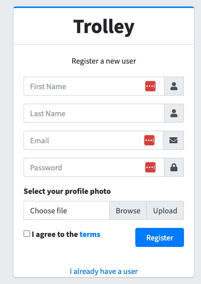
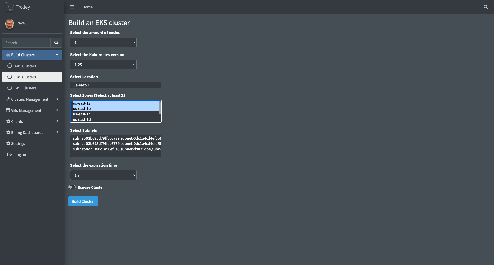
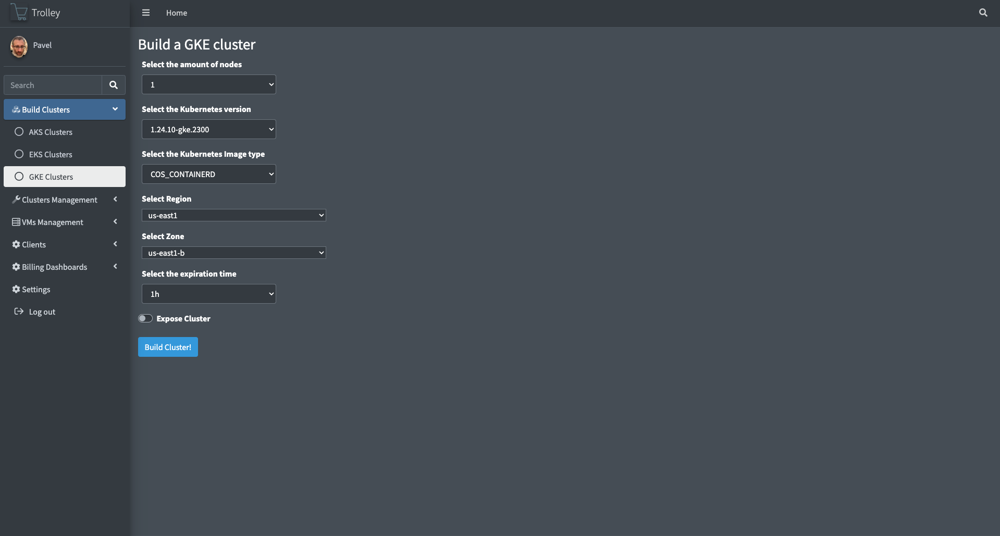

# Trolley

Trolley is a multi cloud Kubernetes management system. A simplified UI which allows the user to Deploy, Edit and Delete clusters and deployments within them on AWS, Azure and GCP. 

## The headache 
For many, the deployment process of a cluster isn’t trivial. Product people, marketing, testers, junior programmers. They all know it can be a pain. With this simple GUI, the deployment process becomes so much easier. You choose the different required parameters via multi selection live list, i.e. server location, cluster version etc, and click deploy. That’s it. deploy>boom>cluster.

Many team leaders know how painful trying to monitor and supervise their team’s clusters can be. Even more when your team is using more than one cloud provider. At some point, you find this hidden cluster which has been bleeding your money dry for the last two weeks. 

The clusters built with Trolley have an expiration date, and they will show on your UI  monitoring screen and database.

## The boom part
In order to deploy a cluster on a managed Kubernetes platform such as GKE/AKS and EKS all the user needs to do is select a few simple options from the provided build menu and set the expiration time. 
Once the build concludes the user will get an Email/Slack alert (tba) with all the info they need.
Alternatively, the user can go to the management menus and see there all the clusters they deployed.


## Deployment
Trolley deployment can be done in the following ways:

### Local deployment
To run the service locally and play with the code just do the following:
1. Run a local/remote/managed MongoDB instance. The details are here:
https://www.mongodb.com/docs/manual/installation/
After the installation is done, create a new database and call it "trolley" or whatever you want your fork to be called.
2. Fork the trolley repository and then clone it locally.
You will need to fork it in order to trigger your own GitHub Actions that will build the clusters
3. Generate a personal GitHub Token that will allow you to use GitHun Actions. The token should The tokens can be obtained from here:
https://github.com/settings/tokens
It should look something like this: ghp_XXXXXXXXXXXXXXXX
4. Build a virtual environment:
        ```
        python3 -m venv trolley_venv
        ```
5. Install all the requirements:
        ```
        pip install -r web/requirements.txt
        ```
6. To run the flask based Python web app in your IDE of choice you can:
Set your Environment Variables menu the following:

    ```
    PYTHONUNBUFFERED=1;SECRET_KEY=s3cr3t_k3y;MONGO_USER=<mongo_user>;MONGO_PASSWORD=<mongo_password>;GITHUB_ACTION_TOKEN=ghp_<token>;MONGO_URL=<mongo_url>;PROJECT_NAME=trolley;GITHUB_REPOSITORY=<your_github_user/your_fork>
    ```

7. To run the app in your IDE just set the script path to web/main.py and it should work from there


### Docker image build and deployment.
1. In order to work with the Docker image the following steps must be taken.
2. Assuming the repository was forked and cloned:
3. Build the docker and tag it as the latest using the following command:
    ```
     docker build -t trolley/latest -f Dockerfile .
     ```
4. Run the image using this command:
     ```
    docker run \
    -e SECRET_KEY='s3cr3t_k3y' \
    -e MONGO_USER='<mongo_user>' \
    -e MONGO_PASSWORD='<mongo_password>' \
    -e GITHUB_ACTION_TOKEN='<github_token>' \
    -e MONGO_URL='<mongo_url>' \
    -e PROJECT_NAME='trolley' \
     -d -p 8081:8081  trolley/latest
     ```

### Docker run the latest stable from dockerhub
1. There's another, safer option to pull the image from the dockerhub repository where we'll hast the latest stable version:
    ```
    docker pull pavelzagalsky/trolley
    ```
2. Run the image:
     ```
    docker run \
    -e SECRET_KEY='s3cr3t_k3y' \
    -e MONGO_USER='<mongo_user>' \
    -e MONGO_PASSWORD='<mongo_password>' \
    -e GITHUB_ACTION_TOKEN='<github_token>' \
    -e MONGO_URL='<mongo_url>' \
    -e PROJECT_NAME='trolley' \
     -d -p 8081:8081  trolley/latest
     ```

## GitHub Actions parameters
In order to build the clusters we will need to pass AWS/GCP/Azure/Mongo related parameters.
Here are the parameters:

## UI Overview
The UI currently consists of the following flows [tba]






### Registration
The registration menu will allow the user to register a user that will allow it to build/delete and edit the builds online.

When the user clicks deploy, it triggers a Jenkins build which formulates the specific CLI command and deploys the desired cluster. The built cluster would then register in the mongoDB database and be available to monitor, extract data or delete via the UI. 


The project is still at a very early stage and would appreciate any contributions and feedback.  

### GCP Authentication TBD
This needs to be run to allow yaml deployments:

gcloud projects add-iam-policy-binding <project_name> --member=<your_service_account>@developer.gserviceaccount.com --role=roles/container.admin
